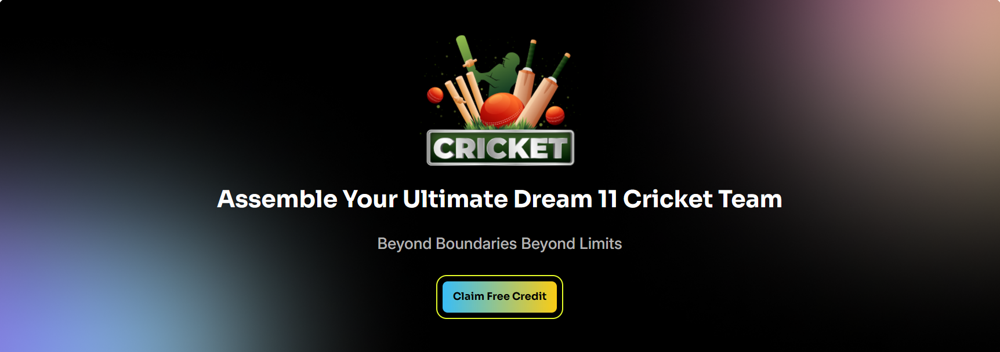
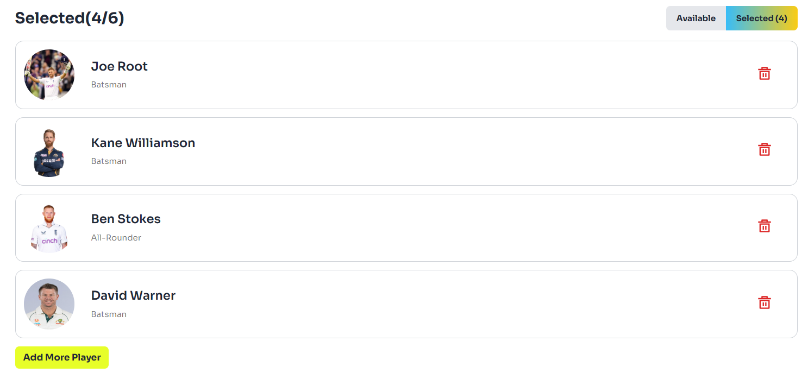

#  [DreamTeam-XI](https://dreamteam-xi.netlify.app/)

Welcome to **DreamTeam-XI**! This is a React-based application designed to reinforce foundational React concepts through an interactive user experience. Users can select and manage cricket players to build their ideal team, add players within a coin limit, and switch between available and selected players—all within a responsive, user-friendly UI.

---

## Project Description

DreamTeam-XI is designed to simulate a team-building experience for cricket fans. Users can add players to their team within a specified coin limit, switch views between available and selected players, and manage their selected team with ease. The app uses fake JSON data for player information and incorporates user-friendly notifications with React-Toastify.

---

## Technologies Used

- **HTML**: Markup language for structuring the web application.
- **React**: JavaScript library for building the user interface and managing component states.
- **React-Toastify**: Provides customizable, easy-to-use notifications for enhanced user interaction.
- **Tailwind CSS**: Utility-first CSS framework for creating responsive, Figma-based designs.
- **JSON**: Used to store and manage player data for dynamic rendering.

---

## Key Features

1. **Dynamic Player Selection & Coin Management**

   - Users can add players based on available coins, with alerts for insufficient coins, duplicate selections, successful player additions, and exceeding the player limit.

2. **Interactive Team Management**

   - Easily toggle between "Available Players" and "Selected Players." Remove players or add more players within the selection limit (maximum of 6 players).

3. **Responsive Notifications with React-Toastify**

   - Real-time feedback for user actions, such as insufficient coins, duplicate players, or exceeding player limits, enhancing the overall user experience.

4. **Loading Data from JSON**

   - Fetches player data from a JSON file to dynamically render player information, including player names, roles, and prices.

5. **Responsive Design with Tailwind CSS**

   - Ensures a seamless user experience across devices with a mobile-first approach and responsive design elements.

6. **Local Storage**
   - Utilizes local storage to save the user's email upon subscribing to the newsletter.

---

## Screenshot

### Navbar

### Banner

### Available Players

### Selected Players

### Newsletters

### Footer

